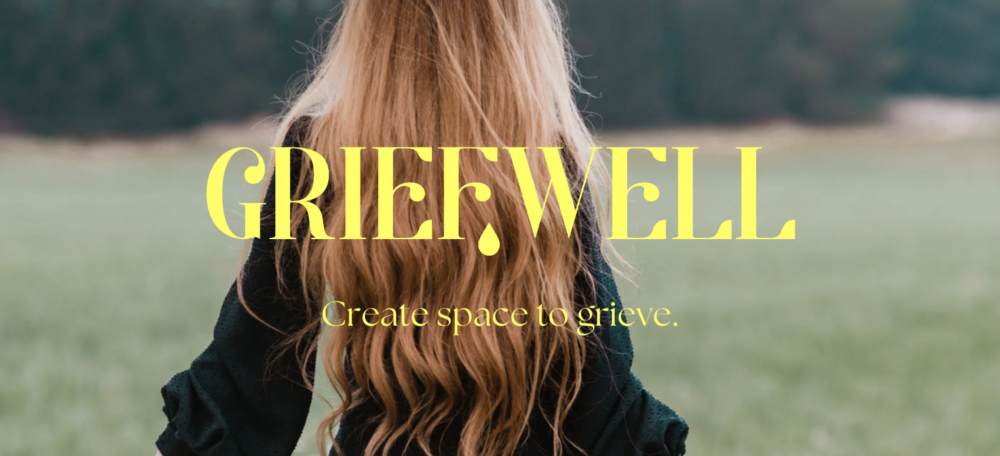
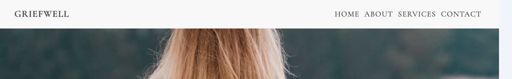
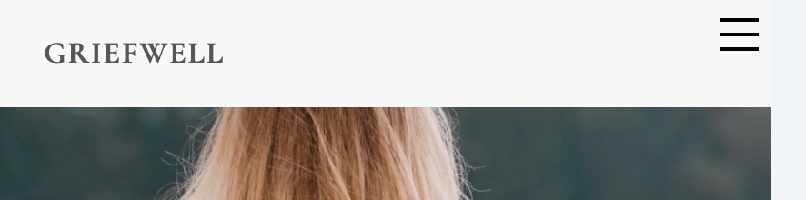

# Griefwell London
## Website Overview
Welcome to Griefwell - Griefwell was founded by Felicia McDonald, who suffered the sudden loss of her beloved mother in 2020, two weeks before the UK went into lockdown. Subsequently she also lost her health and her sense of identity and gradually had to find a way to rebuild her life and herself. Realising how ill-equipped she was in handling her loss and grief, she went on a journey to discover ways to overcome them. Now, as a certified Grief Recovery Specialist and Coach, Decluttering Coach, and Reiki Practitioner, she helps women create the ​emotional and physical space to help them process a loss, and to empower them to be an active participant in their grief ​journey.

### Website Link
[Griefwell London](https://clemencehuang.github.io/Project_1/)

&nbsp;

&nbsp;
***
&nbsp;

## Technology Used

### Languages Used

-   [HTML5](https://en.wikipedia.org/wiki/HTML5)
-   [CSS3](https://en.wikipedia.org/wiki/Cascading_Style_Sheets)

### Frameworks, Libraries & Programs Used

-   [Google Fonts:](https://fonts.google.com/)
    - Google Fonts was used to find the font family "Cormorant+Garamond" which is being used across the entire site. Various font weights are being used for stylistic reasons, to differentiate between headings and body text.
-   [Canva:](https://www.canva.com/)
    - Canva was used to create the home page hero image with the neon yellow logo overlay.
-   [Burger Menu:](https://codepen.io/alvarotrigo/pen/PoJGObg) 
    - Code referenced to make the burger menu and hover across all pages.
-   [Git](https://git-scm.com/)
    - Git was used for version control by utilizing the command line terminal to commit to Git and Push to GitHub.
-   [GitHub:](https://github.com/)
    - GitHub was used to store the project code after being pushed from Git.

&nbsp;
***
&nbsp;

## Content and Structure

### Header
The same header is used across the site to hold the navigation bar and the site title.

### Logos
The logo is set in an elegant, gentle font with serif detailing to reference the bespoke service Griefwell offers. A special font was used on the hero landing page image to set the scene; a neon yellow was used in deliberate contrast to the otherwise earthy colours of the site, to give a modern twist and add an uplifting element to it.

### Color Scheme
A subdued colour palette in pastel tones has been chosen to create a gentle website environment that feels inviting and open to a potential female client base. 

### Navigation Bar
* The navigation bar appears on all four pages. 
* It contains links to Home, About, Services and Contacts pages.
* The menu sits in a horizontal flow for larger screen sizes and turns into a burger menu for mobile and tablet.
  

### Footer
* The footer is replicated across all pages, deliberately sticking to the the bottom of each page, acting as a re-enforcement of the Griefwell brand and name.

&nbsp;
***
&nbsp;

## Future-Enhancements

* Create more varied layouts across each page in order to feel less repetitive and more engaging for the user.
* Add two more photos to the About page: one of Felicia McDonald and one black and white childhood photo of her with her mother.
* Add a form to the Contacts page so that users can send messages to Felicia McDonald.
* Evolve the website into a full services platform where users can book services and exhange messages on a community forum.
* Add a live calendar of events.

&nbsp;
***
&nbsp;

## Testing

The W3C Markup Validation Service and W3C CSS Validation Service were used to validate every page of the project to ensure there were no syntax errors in the project.

-   [W3C Markup Validator](https://validator.w3.org) 
    
    **HOME** page:

    Initial tests show four warnings and two errors to be corrected.
    
    After fixing the errors, the final test results confirm no errors. I've left the warnings untouched for now as my mark-up was previously too complex, resulting in display errors linked to the css. I had deliberately made the mark-up simpler so felt it was best to leave it untouched at this stage.
    

    **SERVICES** page:

    Initial tests show various errors to be corrected.
    
    After fixing the errors, the final test results confirm no errors or warnings.
    

    **CONTACT** page:

    Initial tests show various errors to be corrected.
    
    After fixing the errors, the final test results confirm no errors or warnings.
    
    [W3C CSS Validator](https://jigsaw.w3.org/css-validator)  

    **CSS**:

    Initial tests show various errors to be corrected.
    
    After fixing the errors, the final test results confirm no errors or warnings.
    

### Further Testing

-   The Website was tested on Google Chrome, using DevTools across various breakpoints for mobile, tablet, laptop and desktop.
-   All links were tested across all pages and device breakpoints.

### Accessibility
Making the website accessible was paramount in order to adhere to web standards but most importantly, to be able to reach as wide an audience as possible and to make the user experience across various devices as user friendly and legible as possible.

* Semantic elements are used throughout the website
* All images were converted into WEBP, a reduced file size to support the load time of images (https://image.online-convert.com/).
* All images contained an alt tag whenever possible.
* The site is responsive to different screen sizes.

### Known Bugs

* About Page: The hero image on the About page disappears in mobile view. 
    - Solution:  xxxxx. 

&nbsp;
***
&nbsp;

## Deployment
I deployed the page on GitHub pages via the following procedure: -

1. From the project's [repository](https://github.com/clemencehuang/project_01), go to the **Settings** tab.
2. From the left-hand menu, select the **Pages** tab.
3. Under the **Source** section, select the **Main** branch from the drop-down menu and click **Save**.
4. A message will be displayed to indicate a successful deployment to GitHub pages and provide the live link: [Griefwell London](https://clemencehuang.github.io/Project_1/)

&nbsp;
***
&nbsp;

### Credits
Thank you to the following people who have helped me on my web development journey so far and in supporting me with my first project.

* [Komal Karir](https://github.com/kkarir-waes) - My enthusiastic course tutor who has been a great support whenever there is a hurdle to overcome and who has inspired me to embrace my inner geek.
* **My fellow students** - My fellow Fullstack Web Development bootcamp students who make it such a fun class to be in — the support we offer one another so far has been immense. Special shout out to [Phil De Hovre](https://github.com/phildehovre)!

### General References
* I used online course material from the Code Institute to learn HTML and CSS alongside W3Schools, Stack Overflow, CodePen and YouTube for general "How To's". I used the Mimo app as an additional learning path which helped with step-by-step practice and also offered snippets of new code that I hadn't picked up through the Code Institute modules.

### Content
* All content and photos were provided by Felicia McDonald.

&nbsp;
***
&nbsp;

### Thank you for reading me!
