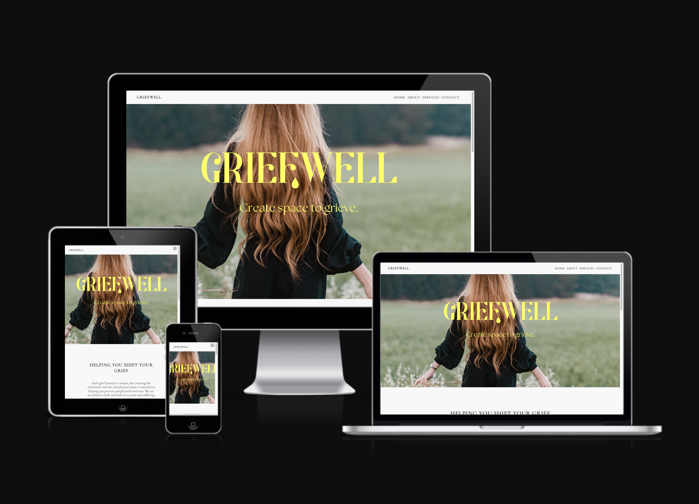

# Griefwell London
## Website Overview
Welcome to Griefwell - Griefwell was founded by Felicia McDonald, who suffered the sudden loss of her beloved mother in 2020, two weeks before the UK went into lockdown. She also lost her health and her sense of identity and gradually had to find a way to rebuild her life and herself. Realising how ill-equipped she was in handling her loss and grief, she went on a journey to discover ways to overcome them. Now, as a certified Grief Recovery Specialist and Coach, Decluttering Coach, and Reiki Practitioner, she helps women create the ​emotional and physical space to help them process a loss, and to empower them to be an active participant in their grief ​journey.

### Website Link
[Griefwell London](https://clemencehuang.github.io/Project_1/)

***

## Technology Used

### Languages Used

-   [HTML5](https://en.wikipedia.org/wiki/HTML5)
-   [CSS3](https://en.wikipedia.org/wiki/Cascading_Style_Sheets)

### Frameworks, Libraries & Programs Used

1. [Google Fonts:](https://fonts.google.com/)
    - Google Fonts was used to find the font family "Cormorant+Garamond" which is being used across the entire site. Various font weights are being used for stylistic reasons, to differentiate between headings and body text.
1. [Canva:](https://www.canva.com/)
    - Canva was used to create the home page hero image with the logo overlay.
1. [Burger Menu:](https://codepen.io/alvarotrigo/pen/PoJGObg) 
    - Code referenced to make the burger menu and hover across all pages.
1. [Git](https://git-scm.com/)
    - Git was used for version control by utilizing the command line terminal to commit to Git and Push to GitHub.
1. [GitHub:](https://github.com/)
    - GitHub was used to store the project code after being pushed from Git.

***

## Content and Structure

### Header
The same header is used across the site to hold the navigation bar and the site title.

### Logos
* The logo is set in an elegant, gentle font with serif detailing to reference the bespoke service Griefwell offers.

### Color Scheme
A subdued colour palette in pastel tones has been chosen to create a gentle website environment that feels inviting and open to a potential female client base. 

### Navigation Bar
* The navigation bar appears on all four pages. 
* It contains links to Home, About, Services and Contacts pages.

## Footer
* The footer is repliacated across all pages, deliberately sticking to the the bottom of each page, acting as a re-enforcement of the Griefwell brand and name.

## Future-Enhancements

* In the future, this site will enable locality hubs - to enable nation-wide activities.

* I would also like to include activities which are based abroad, female only trips etc.

* I would also like to host business podcasts or a blog, where Black Owned businesses could talk more about their services or products and where start ups could connect with the established community and gain resources while they start their entrepreneurial journey.

* With the backend functionality I will be able to include aspects like searchable activities and businesses, a profile area and chat function.

* There should also be a payment element to enable bigger activities where a charge/booking fee/ reservation fee may be needed. 

* To support growth, I will link social media and google accounts. I will also enable sign up functionality where I can store and use contact information for marketing and promotional material.

## Testing

The W3C Markup Validator and W3C CSS Validator Services were used to validate every page of the project to ensure there were no syntax errors in the project.

-   [W3C Markup Validator](https://validator.w3.org/nu/) 
    
    HOME page:

    Initial tests show various errors to be corrected.
    
    After fixing the errors, the final test results confirm no errors or warnings.
    

    ABOUT page:

    Initial tests show various errors to be corrected.
    
    After fixing the errors, the final test results confirm no errors or warnings.
    

    SERVICES page:

    Initial tests show various errors to be corrected.
    
    After fixing the errors, the final test results confirm no errors or warnings.
    

    CONTACT page:

    Initial tests show various errors to be corrected.
    
    After fixing the errors, the final test results confirm no errors or warnings.
    
    [W3C CSS Validator](https://jigsaw.w3.org/css-validator)  

    CSS:

    Initial tests show various errors to be corrected.
    
    After fixing the errors, the final test results confirm no errors or warnings.
    

    However, the initial test on the stylesheet showed the use of webkit within the backface code (lines 227 and 237) were not best practice. After removing these the images in firefox for the     activities page do not perform the same as their counterparts on the Edge browser. 

    I have included a screenshot of compatibility for the use of backface across the browsers, I am unable to investigate further due to time restraints.
    

### Further Testing

-   The Website was tested on Google Chrome, using DevTools across various breakpoints for mobile, tablet, laptop and desktop.
-   All links were tested across all pages and device breakpoints.

### Accessibility
Making the website accessible was paramount in order to adhere to web standards but most importantly, to be able to reach as wide an audience as possible and to make the user experience across various devices as user friendly and legible as possible.

* Semantic elements are used throughout the website
* All images were converted into WEBP, a reduced file size to support the load time of images (https://image.online-convert.com/)
* All images contained an alt tag
* The site is responsive to different screen sizes

## Known Bugs

* xxxxx. 
    - Solution:  xxxxx. 

## Deployment
I deployed the page on GitHub pages via the following procedure: -

1. From the project's [repository](https://github.com/clemencehuang/project_01), go to the **Settings** tab.
2. From the left-hand menu, select the **Pages** tab.
3. Under the **Source** section, select the **Main** branch from the drop-down menu and click **Save**.
4. A message will be displayed to indicate a successful deployment to GitHub pages and provide the live link.

***
***

## Credits

### Thank you's
This project could not have happened without the support of the following people listed in no particular order:

* [Komal Karir](https://github.com/kkarir-waes) - My course tutor...
* [Phil De Hovre](https://github.com/phildehovre) - My fellow Fullstack Web Development bootcamp student who kindly helped me solve issues with a niggling hidden burger menu upon mouse-click and removing the excess margin issue during the build.

### General Reference
* I relied upon W3schools, youtube and stack overflow for general "how to's" throughout the project alongside course material from Code Institute. 

### Content
* All content and photos were provided by Felicia McDonald.

***
***

### **Thank you!**
